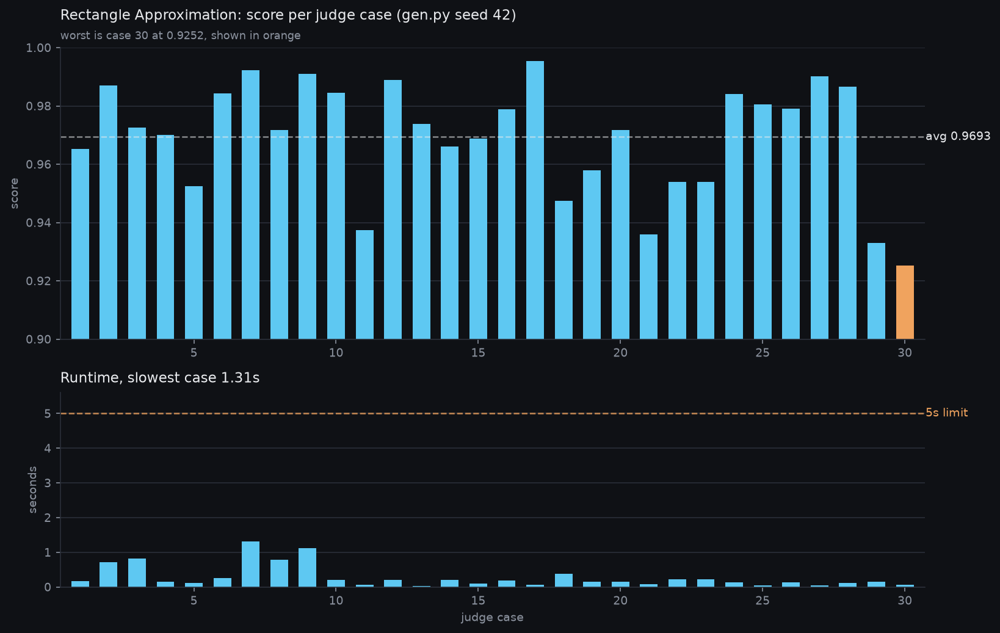
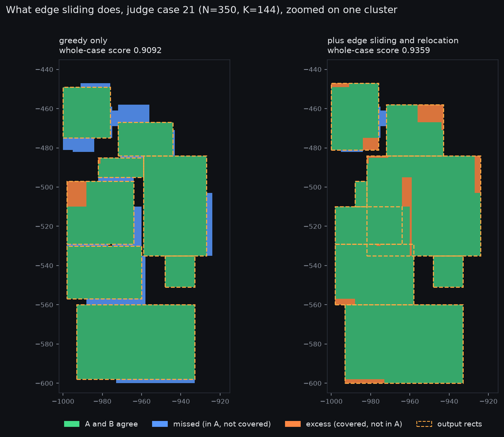
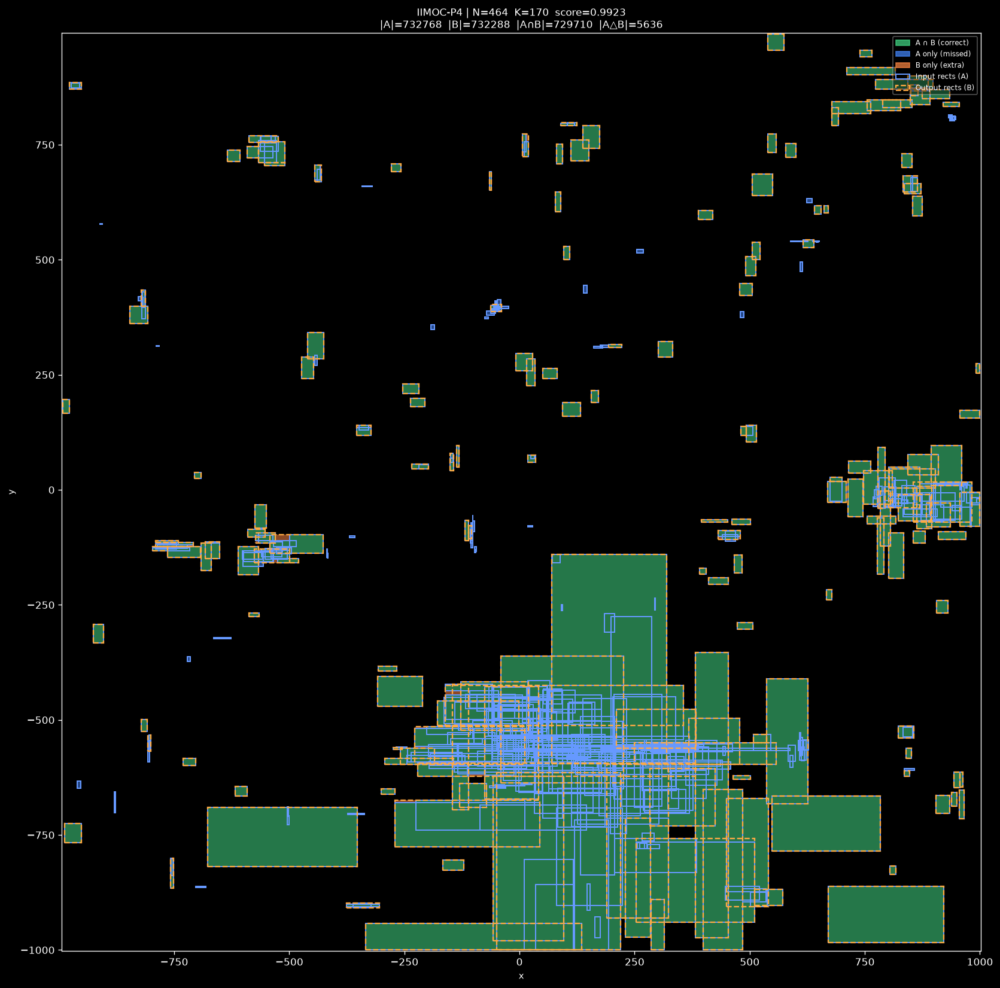
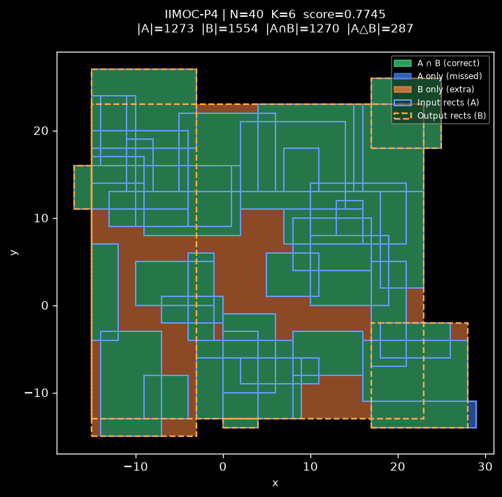
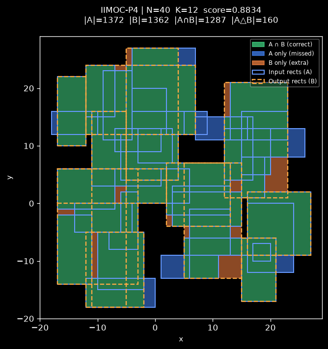
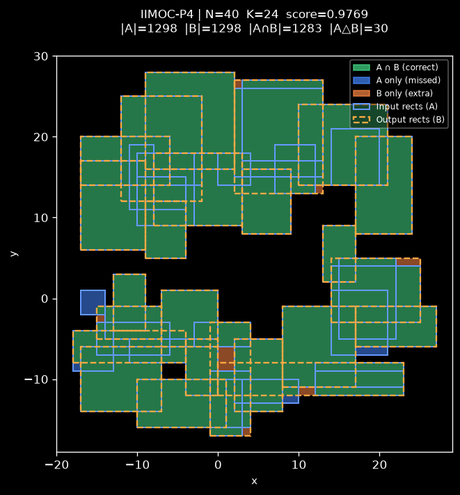
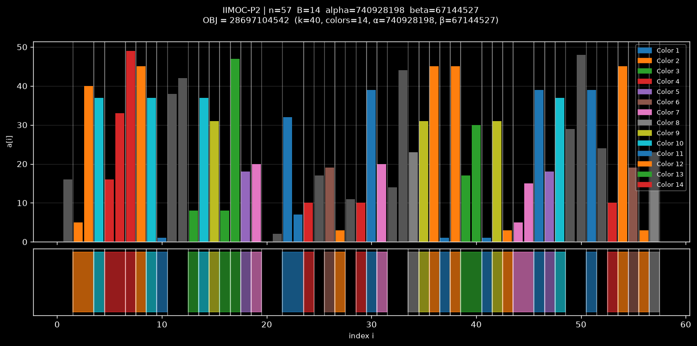

# IIMOC-2026

My solutions to two optimization problems from IIMOC 2026. Both are heuristic
problems, so there is no "correct" answer, you just get scored on how good your
output is and you keep tweaking until the number stops going up.

Final judge results:

| Problem | Score | Raw score |
| --- | --- | --- |
| Rectangle Approximation | 99.23% | 388.67358900000016 |
| Chromatic Block Harmony | 99.88% | 800425419096089 |

Total 199.10702590133934.

## Files

```
square_approximation.py    solution to Rectangle Approximation
block_harmony.py           solution to Chromatic Block Harmony

squareapproximation/       problem package for Rectangle Approximation
  statement.txt              full problem statement
  gen.py                     official test generator (seed 42 = judge cases)
  config.yaml                limits, 5s and 512MB
  vis.py                     draws a picture of an input/output pair
  smalltest/                 sample cases, .in / .ans / .output / .png

blockharmony/              same layout, 3s and 512MB

viz/                       rendered output of my solutions, see below
  rect_summary.png           score and runtime across all 30 judge cases
  ablation/                  what edge sliding changes
  rect/                      12 judge cases rendered by vis.py
  demo/                      small hand-made cases at three budgets
  block/                     Block Harmony cases, small n so they're readable
```

Both solutions read stdin and write stdout, no arguments:

```
python3 square_approximation.py < squareapproximation/smalltest/1.in
python3 block_harmony.py < blockharmony/smalltest/1.in
```

To reproduce a judge case, `python3 gen.py 42 <case_id>` inside the problem
folder. Case ids run 1 to 30.

## Pictures

Everything in `viz/` was produced by running my solutions on generated cases and
feeding the input and output to the official `vis.py`. It needs matplotlib and
numpy, which are not in the system python here, so:

```
python3 -m venv venv && ./venv/bin/pip install matplotlib numpy
python3 squareapproximation/gen.py 42 7 > case7.in
python3 square_approximation.py < case7.in > case7.out
./venv/bin/python squareapproximation/vis.py case7.in case7.out --out case7.png
```

Green is area both A and B cover, blue is area in A that I missed, orange is area
I covered that isn't in A. The score is one minus the blue plus orange divided by
the total.

### Where the score comes from



Every judge case scored and timed. Average is 0.9693 and the slowest case is
1.31s against a 5 second limit, so there's real headroom left. The spread is not
random: the low cases are the ones where K is small relative to how spread out
the input is, so there are not enough output rectangles to go around.

### What edge sliding does



This is the same cluster with the edge sliding and relocation passes turned off
and then on. On the left the greedy build-up leaves blue seams between its
rectangles, because it only ever places rectangles that fit entirely inside A and
those never quite meet. On the right the edges have grown across the seams. It
picks up a few orange slivers of excess doing it, but the blue it removes is
worth much more, and only moves that improve the score get kept.

Measured on four judge cases, running the same solution with those two passes
disabled:

| Case | greedy only | full | gain |
| --- | --- | --- | --- |
| 5 | 0.9348 | 0.9525 | +0.0177 |
| 21 | 0.9092 | 0.9359 | +0.0267 |
| 24 | 0.9768 | 0.9841 | +0.0073 |
| 27 | 0.9848 | 0.9901 | +0.0053 |

### A full judge case



Case 7, N=464 and K=170, scoring 0.9923. This is what the generator's output
looks like: a lot of isolated small rectangles, which are basically free
because each one gets its own output rectangle, plus one dense clump in the
bottom middle where all the difficulty is. You can see the blue concentrated
entirely in that clump. The clustering step is what lets the budget allocator
notice that and spend most of K there.

More cases are in `viz/rect/`.

### How the budget changes the answer

| K = 6 | K = 12 | K = 24 |
| --- | --- | --- |
|  |  |  |

Same 40 rectangle input, three different budgets. These are hand-made rather than
judge cases, because the real small cases all have K close to N and come out
perfect, which makes for a boring picture. At K=6 there is nowhere near enough
budget so the solution covers the blob with a few big rectangles and eats a lot
of orange excess. By K=24 it can trace the actual boundary.

### Block Harmony



The top panel is the array with each selected block colored by its assigned
color, and the bottom strip shows the blocks as intervals so you can see they
never overlap. Every block of a given color has the same sum, which is the
constraint that makes the problem interesting. Grey bars are elements not used by
any block.

The large judge cases render as a 57000 pixel wide strip and are unreadable, so
`viz/block/` only has the small-n cases plus the statement samples.

## Rectangle Approximation

You get N axis-aligned rectangles and a number K, and you have to output exactly
K rectangles whose union is as close as possible to the union of the input. Score
per case is `max(0, 1 - |A xor B| / |A|)` where A is the input union and B is
yours. N goes up to 1000, coordinates are integers in [-1000, 1000], and the
input rectangles are allowed to overlap each other.

### How my solution works

**Clustering.** Rectangles that don't touch can't help each other, so a union
find pass splits the input into connected components and each one gets solved
separately. This is the whole reason the thing is fast: the judge cases from
gen.py have lots of small clumps rather than one giant blob.

**Coordinate compression.** Only the x and y values that appear in the
input ever matter, so every grid in the file is a compressed grid where one cell
stands for a whole rectangle of real area. Cell areas get carried around as
`cell_dx` and `cell_dy` instead of being assumed to be 1.

**Building an answer (`build_up`).** Greedy, one rectangle at a time, always
taking whichever rectangle helps the most. The "helps the most" part has two
possible definitions and I tried both:

- Max gain, where a rectangle's value is (new area of A it covers) minus (area
  outside A it wastes). If you write +area on cells inside A and -area on cells
  outside, this is exactly the max-sum subrectangle, which 2D Kadane solves in
  O(nx^2 * ny). That's `max_sum_subrect`.
- Zero excess, where you only consider rectangles that lie entirely inside A, so
  the value is just plain area. That's a largest-rectangle-in-a-histogram sweep
  in O(nx * ny), which is `largest_rect_in_A`.

Zero excess won, and not by a little. It was about 25 times faster (8 to 10 ms
per call versus 200 to 250 ms) and it also scored better. Letting a rectangle
swallow some excess looks good locally but it messes up everything you place
afterward. `KADANE_THRESH` is set to 0 for that reason, so Kadane only runs on
tiny inputs where the global path is used.

**Splitting the budget across clusters.** Every rectangle `build_up` places
comes with a gain, and gains inside a cluster are decreasing, so allocating K
across clusters is just a heap: push each cluster's next gain, pop K times.

The important detail is that every cluster starts at 0 budget instead of getting
one rectangle for free. That sounds backwards, since a cluster with 0 rectangles
contributes its entire area to the error, but giving everyone a floor of 1 is
what starves the big clusters when K is close to the number of clusters. Letting
a big cluster's second and third rectangle beat a tiny cluster's first was worth
+0.0245 average, which is one of the biggest single wins in the file.

**Drop-down (`drop_down_cluster`).** The opposite approach: start with all the
input rectangles of the cluster and repeatedly delete the one whose removal costs
the least, until only k are left. This beats build-up when K/N is high and the
input rectangles are already good approximations of themselves. Both get run and
whichever scores better gets kept.

**Edge sliding (`optimize_edges`).** This was the single biggest improvement,
about +0.011 average on its own. For each output rectangle, take one edge at a
time, hold the other three fixed, and scan every position that edge could be at.
Moving out swallows nearby uncovered area but drags in any excess it crosses.
Moving in trims excess off the end. Take the best position, and only if it
strictly improves. The bookkeeping is per cell, with `signed` being +area inside
A and -area outside, and `coverage` counting how many output rectangles sit on
the cell:

- covering a cell nobody else covers changes the score by -signed
- uncovering a cell only this rectangle covers changes it by +signed
- cells another rectangle also covers don't change anything either way

Since only improving moves get applied, running this more can never hurt.

**Relocation (`refine_cluster`).** Find the output rectangle covering the least
area that nothing else covers, delete it, and check whether a bigger rectangle
now fits in the freed space. Keep the swap only if the new one is strictly worth
more. This is what fixes the case where the greedy build-up boxed itself in.

Edge sliding and relocation alternate as coordinate descent until the cluster's
time slice runs out. Each is monotone in score so more rounds only help, and the
time budget is handed out to clusters in proportion to their rectangle budget.

**Special cases.** If K >= N you can just print the input and score exactly 1.0,
which is worth checking first. If the whole input is small enough that all
coordinate pairs fit in memory, it gets solved as one global instance instead of
clustering.

**Safety caps.** `CELL_CAP` and `WORK_CAP` bail out to a cheap answer if a
cluster's compressed grid is enormous. This never fires on real judge data, since
gen.py shrinks the rectangles as N grows, but a pathological dense cluster would
otherwise blow the time limit.

### Score progression

Local benchmark over the judge generator, seed 42, cases 1 to 30:

| Change | Score |
| --- | --- |
| baseline greedy | 0.9326 |
| fixed the `build_up` gains bug | 0.9119 to 0.9267 |
| from-scratch budget allocation | 0.9458 |
| edge sliding both directions | 0.9693 |

That last number is a 3.94% improvement over the baseline. That sounds small, but
at the top of the leaderboard everyone is scoring above 95%, so almost all of the
separation between submissions lives in the last few percent.

### Things that didn't work

**Mixing Kadane and histogram.** I spent a while assuming the smarter primitive
(max gain, allowed to take beneficial excess) had to be better and only used the
histogram version as a speed fallback for big grids. It's just worse. Set to 0
and never looked back.

**merge_to_budget.** A pass that merges pairs of output rectangles when their
bounding box is cheaper than keeping both. It genuinely improved individual
instances, which is why I kept it for a while, but it cost enough runtime that
the full pipeline average went down, 0.9693 to 0.9691. Fully removed. Lesson:
measure the pipeline, not the function.

**Raising AUTO_THRESH to 3M.** Let bigger clusters use the expensive path. Caused
TLE-induced score drops on several seeds. Reverted.

**A gains diagnostic that lied to me.** I had a probe reporting that a greedy
pass found 72 rectangles when the real count was 165. The time guard was firing
during the probe itself, so the probe was measuring its own interruption. Worth
remembering that instrumentation can be the bug.

**The TLE.** At one point a single case went from 0.07s to 5.50s. The cause was
the per-cluster time budget being computed too loosely, so a handful of clusters
ate everything and the rest ran with no guard at all. The fix is the
`remaining_b` proportional split in `main()`.

## Chromatic Block Harmony

You get an array of n integers and up to B colors. You pick non-overlapping
contiguous blocks and color them, with the rule that all blocks sharing a color
must have the same sum. Objective is `alpha * k - beta * C` where k is the number
of blocks and C is the number of distinct colors used. Choosing a color costs you
beta, so a color only pays for itself if enough blocks use it. n goes up to 50000,
B up to 20, and array values are in [0, 50].

### How my solution works

The key realization is that a color is really just "a sum value", so the whole
problem is: pick at most B sums, then pack as many non-overlapping blocks with
those sums as you can. Once the sums are chosen, packing is just interval
scheduling, which greedy solves exactly by taking blocks in order of right
endpoint.

**Finding blocks with a given sum.** Prefix sums plus binary search. For each
left endpoint L, the right endpoint is wherever `P[L-1] + s` shows up in P, if it
does. Results are cached per sum, since the same sums get queried constantly.

**Picking candidate sums.** Every value that appears in the array is a candidate,
because a single element is a valid block. On top of that, sums of windows of
length 2 to 20 that appear often enough get added. Then all candidates get ranked
by `greedy_count`, an O(n) estimate of how many disjoint blocks that sum alone
can fit, and only the top ones survive.

**Phase 1, single elements only.** If you only use single-element blocks, they
can never overlap, so the objective is exactly `alpha * sum(freq) - beta * C` and
you can pick greedily by frequency with no scheduling needed. This gives a solid
baseline instantly and is often already optimal when beta is large.

**Phase 2, greedy forward pass.** Add colors one at a time, each time taking the
one that improves the objective most. The trick that makes this affordable is
keeping the merged block list incrementally, so testing a candidate is a linear
merge rather than rebuilding everything.

**Phase 3, swap refinement.** Try replacing each chosen sum with an unchosen one.
Prefix and suffix merges are precomputed so removing color i from the set is O(1)
lookups plus one merge rather than re-merging all B lists.

### Things that didn't work

**Unbounded swap refinement.** Phase 3 originally ran until it converged. On
n=10000 it found zero improvements and cost an extra 0.72 seconds, and on judge
case 33 it TLEd outright. It's now guarded by a 2.4 second budget against a 3
second limit, plus a size check, and it bails the moment it stops finding swaps.

**The tagged_select bottleneck.** Profiling showed 2.1 seconds across 1590 calls
in the selection routine alone. Caching the block lists per sum and merging
incrementally instead of re-sorting the full tagged list each time is what made
the rest of the search affordable.
